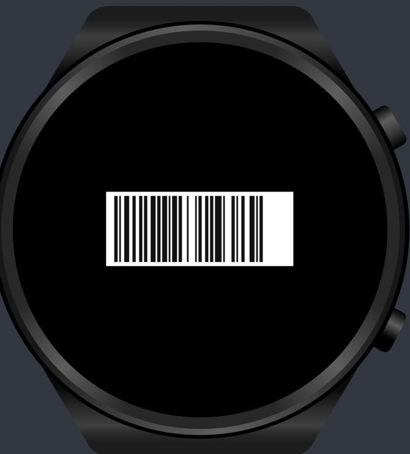
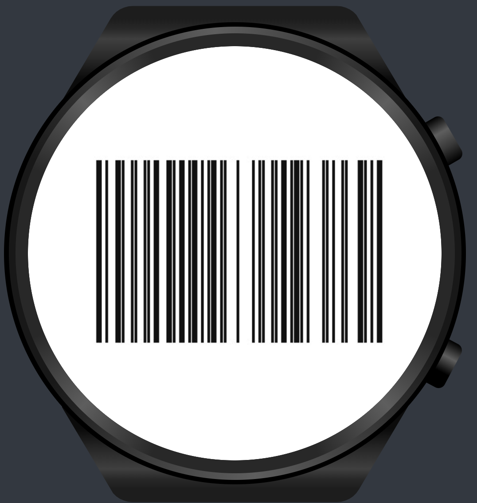
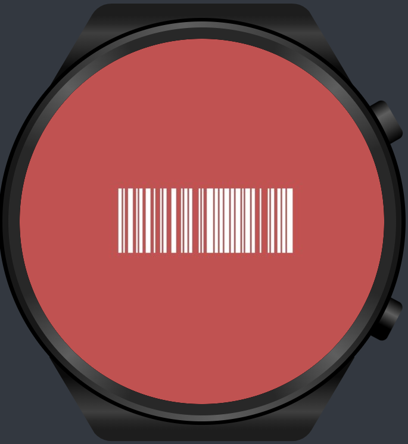
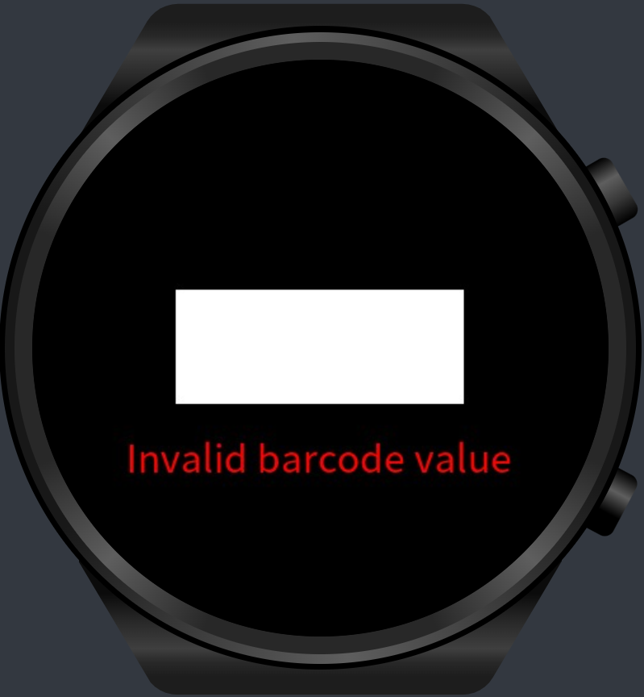

# Barcode Rendering Library for Huawei Lite Wearables

A lightweight JavaScript library for rendering Code 128 barcodes on Canvas component.
 
## Installation

Download the JS SDK:
 

## Usage

### Basic example

**html (xxx.hml)**

```html
<stack style="width: 100%; height: 100%">
  <canvas
    ref="canvasRef"
    style="width: 50%; height: 20%; left: 25%; top: 40%; background-color: #ffffff;"
  ></canvas>
</stack>
```

**Javascript (xxx.js)**

```javascript
import { renderBarcode128, BarcodeErrorCodes } from "../../lib/barcode128";

export default {
  data: {},
  onShow() {
    const canvas = this.$refs.canvasRef;
    renderBarcode128(canvas, "123456789");
  },
};
```



## Configuration Options

| Configuration Key | Type     | Default Value             | Description                                 |
| ----------------- | -------- | ------------------------- | ------------------------------------------- |
| `startingPointX`  | number   | 10                        | X-coordinate where barcode rendering starts |
| `startingPointY`  | number   | 5                         | Y-coordinate where barcode rendering starts |
| `barHeight`       | number   | 80                        | Height of each bar in pixels                |
| `barWidth`        | number   | 2                         | Width of each bar in pixels                 |
| `barColor`        | string   | '#111111'                 | Color of the bars (dark bars)               |
| `bgColor`         | string   | '#ffffff'                 | Background color (light bars)               |
| `onRenderFailed`  | function | code=>console.error(code) | Callback function for rendering errors      |

### Customization Examples

##### Example 1: Size and position

**html (xxx.hml)**

```html
<stack style="width: 100%; height: 100%;">
  <canvas
    ref="canvasRef"
    style="width: 100%; height: 100%; background-color: #ffffff;"
  ></canvas>
</stack>
```

**Javascript (xxx.js)**

```javascript
renderBarcode128(canvas, "123456789", {
  startingPointX: 75,
  startingPointY: 125,
  barHeight: 200,
  barWidth: 3.5,
});
```



#### Example 2: Colors

**html (xxx.hml)**

```html
<stack style="width: 100%; height: 100%; background-color: #ffc05252;">
  <canvas
    ref="canvasRef"
    style="width: 50%; height: 20%; left: 25%; top: 40%; background-color: #ffc05252;"
  ></canvas>
</stack>
```

**Javascript (xxx.js)**

```javascript
const canvas = this.$refs.canvasRef;
renderBarcode128(canvas, "123456789", {
  bgColor: "#FF0000",
  barColor: "#FF00FF",
});
```



## Error Handling

The library provides these error codes:

| Error Code             | Value | Description                                | troubleshoot                                                                              |
| ---------------------- | ----- | ------------------------------------------ | ----------------------------------------------------------------------------------------- |
| `CANVAS_UNDEFINED`     | 0     | Canvas object is undefined                 | check if ref name is correct, invoke barcode rendering in the onShow() lifecycle function |
| `VALUE_INVALID`        | 1     | Value contains invalid characters          | check if input contains letters or special characters                                     |
| `VALUE_LENGTH_INVALID` | 2     | Barcode value exceeds length limit         | check if input length is greater than 255                                                 |
| `INTERNAL_ERROR`       | 3     | Unexpected error during barcode generation | see logs for clues                                                                        |

### Error Handling example

**html (xxx.hml)**

```html
<stack style="width: 100%; height: 100%">
  <canvas
    ref="canvasRef"
    style="width: 50%; height: 20%; left: 25%; top: 40%; background-color: #ffffff;"
  ></canvas>
  <text
    style="width: 80%; left: 10%; top: 65%; text-align: center; font-size: 30fp; color: red;"
    >{{ error }}
  </text>
</stack>
```

**Javascript (xxx.js)**

```javascript
import { renderBarcode128, BarcodeErrorCodes } from "../../lib/barcode128";

export default {
  data: {
    error: null,
  },
  onShow() {
    const canvas = this.$refs.canvasRef;
    renderBarcode128(canvas, "@#$%&!", {
      onRenderFailed: (code) => {
        switch (code) {
          case BarcodeErrorCodes.CANVAS_UNDEFINED:
            this.error = "Canvas is undefined";
            break;
          case BarcodeErrorCodes.VALUE_INVALID:
            this.error = "Invalid barcode value";
            break;
          case BarcodeErrorCodes.VALUE_LENGTH_INVALID:
            this.error = "Barcode value too long";
            break;
          case BarcodeErrorCodes.INTERNAL_ERROR:
            this.error = "Internal barcode generation error";
            break;
          default:
            this.error = "Unknown error";
        }
      },
    });
  }
};
```



## Contribution

All kind of contributions are welcome :)

For issues or features requests
please [create an issue](https://github.com/megaacheyounes/lite-wearable-barcode-generator/issues/new)

## License

```
  DO WHAT YOU WANT TO PUBLIC LICENSE
        Version 2, December 2004

Copyright (C) 2025 Younes Megaache

Everyone is permitted to copy and distribute verbatim or modified
copies of this license document, and changing it is allowed as long
as the name is changed.

           DO WHAT YOU WANT TO PUBLIC LICENSE
  TERMS AND CONDITIONS FOR COPYING, DISTRIBUTION AND MODIFICATION

 0. You just DO WHAT YOU WANT TO.
```
